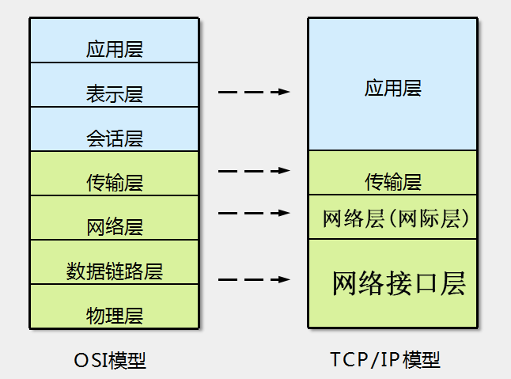

**初级网络维护准备指南**

# 通讯模型

## OSI七层模型

### 第一层 物理层

是参考模型的最低层，建立、维护、断开物理连接，传输单位比特(`Bits`)。

### 第二层 数据链路层

建立逻辑连接、进行硬件地址寻址、差错校验（采用差错控制与流量控制方法，使有差错的物理线路变成无差错的数据链路）等功能，传输单位是`帧`。

链路层屏蔽传输介质的物理特征，使数据可靠传送。

内容包括介质访问控制、连接控制、顺序控制、流量控制、差错控制和仲裁协议等。

### 第三层 网络层

进行逻辑地址寻址，实现不同网络之间的路径选择。

协议有：`ICMP IGMP IP（IPV4 IPV6）`。

传输单位：`包`。

### 第四层 传输层

定义传输数据的协议端口号，以及流控和差错校验。

协议有：`TCP UDP`。

### 第五层 会话层

建立、管理、终止会话。

对应主机进程，指本地主机与远程主机正在进行的会话。

### 第六层 表示层

数据的表示、安全、压缩。(加密与解密、压缩与解压)

格式有：JPEG、ASCll、EBCDIC、加密格式等。

### 第七层 应用层

是参考模型的最高层，网络服务与最终用户的一个接口，如文件服务器、数据库服务、电子邮件与其他网络软件服务。

协议有：`HTTP HTTPS FTP TFTP SMTP SNMP DNS TELNET POP3 DHCP`

## OSI vs TCP/IP

### TCP

TCP（Transmission Control Protocol，传输控制协议）是面向连接的协议，也就是说在收发数据之前，必须先和对方建立连接。

* **三次握手 建立连接**
  
  一个TCP连接必须要经过三次“对话”才能建立起来，简单描述下这三次对话的过程：主机A向主机B发出连接请求数据包：“我想给你发数据，可以吗？”，这是第一次对话；主机B向主机A发送同意连接和要求同步（同步就是两台主机一个在发送，一个在接收，协调工作）的数据包：“可以，你什么时候发？”，这是第二次对话；主机A再发出一个数据包确认主机B的要求同步：“我现在就发，你接着吧！”，这是第三次对话。三次“对话”的目的是使数据包的发送和接收同步，经过三次“对话”之后，主机A才向主机B正式发送数据。
  
  
  
  
  
  

* **四次挥手 释放连接**
  
  
  
  

# 双绞线（网线）标准

## 直通线缆

直通线缆的水晶头两端都遵循`T568B`标准，双绞线的每组线在两端是一一对应的，颜色相同的在两端水晶头的相应槽中保持一致。

它主要用在交换机（或集线器）Uplink口连接交换机（或集线器）普通端口或交换机普通端口连接计算机网卡上。

**T568B线序：** `白橙 、橙、 白绿、 蓝 、白蓝 、绿 、白棕 、棕`。

## 交叉线缆

而交叉线缆的水晶头一端遵循568A，而另一端则采用568B标准，且1-3芯、2-6芯互换。

它主要用在交换机（或集线器）普通端口连接到交换机（或集线器）普通端口或网卡连网卡上。

**T568A线序：** `白绿、绿、白橙、蓝、白蓝、橙、白棕、棕`。

# 网线分类

## 超五类

超五类线：超5类具有衰减小，串扰少，并且具有更高的衰减与串扰的比值(ACR)和信噪比(Structural Return Loss)、更小的时延误差，性能得到很大提高。超5类线主要用于千兆位以太网（1000Mbps）。

# 交换机

### 二层交换机防环

主要协议有：`STP RSTP MSTP RRPP SEP ERPS`

## 三层交换机防环

三层交换机，所谓第三层就是网络层，是负责路由转发的，因此涉及到路由协议如`静态、RIP、OSPF、IS-IS`

主要协议有：`RIP OSPF IS-IS`

# IPV4

## 私网地址

* A类：`10.0.0.0` ~ `10.255.255.255`
  
  * 子网掩码：`255.0.0.0`

* B类：`172.16.0.0` ~ `172.31.255.255`
  
  * 子网掩码：`255.255.0.0`

* C类：`192.168.0.0` ~ `192.168.255.255`
  
  * 子网掩码：`255.255.255.0` 掩24位

## 回环地址

* `127.0.0.1`

## 特殊地址

# 物理隔离&逻辑隔离

## 物理隔离

**定义：** 是指采用物理方法将内网与外网隔离从而避免入侵或信息泄露的风险的技术手段。

**应用：** `网闸、光闸`等。

## 逻辑隔离

**定义：** 逻辑隔离主要通过逻辑隔离器实现，逻辑隔离器是一种不同网络间的隔离部件，被隔离的两端仍然存在物理上数据通道连线，但通过技术手段保证被隔离的两端没有数据通道，即逻辑上隔离。（利用虚拟化技术）

**交换机技术：** `vlan划分`

**二层虚拟网技术：** `L2TP`

**2.5层虚拟网技术：** `MPLS-VPN`

**三层虚拟网技术：** `GRE IPSEC`

# 其他资料

* [网络工程师十个常见面试问题_橙子渣渣的博客-CSDN博客](https://blog.csdn.net/qq_40472181/article/details/105380683)
